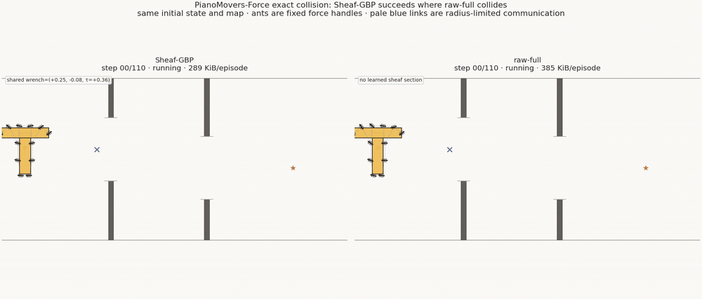

# Sheaf-GBP

Communication-efficient learned sheaf coordination for the
**PianoMovers-Force** benchmark.

<p align="center">
  
</p>

<p align="center">
  <strong>Exact-collision demo</strong>
  · same map and initial state · Sheaf-GBP succeeds · raw-full collides
</p>

## The task

Several agents are fixed to force handles on a rigid T-shaped payload. Each
agent observes only local geometry and may communicate with handles inside a
radius-limited graph. Together they must translate and rotate the payload
through two narrow slits without collision.

The payload state is

```text
q = [x, y, theta, vx, vy, omega] ∈ R^6,
```

and each agent outputs a local planar force `[fx, fy]`. The agents should agree
on the payload motion and net wrench, but not on identical local forces. This
partial-consensus structure is the reason to use a sheaf rather than ordinary
feature averaging.

This repository deliberately isolates force coordination. It does **not** yet
include an LLM, free-moving robots, grasp attachment, or contact switching.

## Model

The claim-bearing configuration uses the following path at every agent:

```text
18-d local observation
  → MLP + GRU (128)
  → diagonal Gaussian stalk (mean 32, precision 32)
  → geometry-grounded learned restriction R_i : R^32 → R^12
  → one diagonal Gaussian-BP sweep on the radius graph
  → local posterior stalk (32) and section (12)
  → analytic wrench allocation + learned decoder
  → local force (2)
```

The first eight section coordinates are supervised physical variables:

```text
[desired load twist (3), desired net wrench (3), passage offset (1), progress (1)]
```

The remaining four are learned coordination channels. Each restriction is an
analytic contact-geometry map plus a rank-4 learned residual. A four-step local
temporal memory contributes unary evidence without wireless communication.

One Sheaf-GBP round transmits a 12-d natural vector and 12-d diagonal precision
per directed edge. The principal baselines are:

- `raw_full`: recurrent MPNN, 32 floats per directed edge and round;
- `comm_matched`: recurrent MPNN, 24 floats—the same payload as Sheaf-GBP;
- `no_comm`: recurrent local policy with no messages.

All arms share the procedural maps, exact compound-body collision test, expert
data, model-induced DAgger states, rollout losses, seeds, training steps, and
evaluation protocol. Sheaf-GBP additionally uses its physically supervised
section head as part of its inductive bias.

## Results

These are paired evaluations on 4,096 held-out procedural maps with exact
rectangle-vs-wall collision. The table reports a fixed 110-step float32 payload
budget; headers, serialization, and transport overhead are not included.

### 12 agents, map-medium

| Method | Success ↑ | Collision ↓ | Floats / directed edge / round | Bytes / episode ↓ |
|---|---:|---:|---:|---:|
| **Sheaf-GBP** | **0.9683** | **0.0317** | 24 | **295,680** |
| raw-full | 0.2715 | 0.7285 | 32 | 394,240 |
| comm-matched | 0.3252 | 0.6748 | 24 | 295,680 |

Paired success difference versus raw-full: `+0.6968`, bootstrap 95% CI
`[0.6816, 0.7117]`. Sheaf-GBP uses 25% fewer payload bytes than raw-full and
substantially outperforms the equal-communication baseline.

### 8 agents, transferred from 12 agents

| Method | Success ↑ | Collision ↓ | Bytes / episode ↓ |
|---|---:|---:|---:|
| **Sheaf-GBP** | **0.9470** | **0.0530** | **274,560** |
| raw-full | 0.4058 | 0.5942 | 366,080 |
| comm-matched | 0.2173 | 0.7827 | 274,560 |

Paired success difference versus raw-full: `+0.5413`, bootstrap 95% CI
`[0.5249, 0.5576]`.

Only these aggregate, collision-audited results and the illustrative demo are
kept in Git. Checkpoints, per-step logs, and bulk evaluation JSON are excluded.

## Install

Python 3.10+ and PyTorch 2.1+ are required. Install the PyTorch build appropriate
for your CPU or CUDA system first, then install the project:

```bash
git clone https://github.com/YuzhouCheng66/sheaf-gbp.git
cd sheaf-gbp
python -m pip install -e ".[dev,video]"
pytest -q
```

The core environment and tests need only PyTorch and NumPy. Video rendering also
requires `ffmpeg` on `PATH`.

## Train matched 12-agent arms

Run each arm with the same script and seed. `DEVICE` may be `cpu`, `cuda`, or a
specific CUDA device.

```bash
DEVICE=cuda scripts/train_map_medium_12.sh sheaf_gbp
DEVICE=cuda scripts/train_map_medium_12.sh raw_full
DEVICE=cuda scripts/train_map_medium_12.sh comm_matched
```

Outputs are written below `runs/map_medium_12/`. Training is intentionally
best-checkpointed because success can be mode-unstable even after the smooth
loss continues to improve.

Evaluate all three checkpoints on paired maps:

```bash
DEVICE=cuda EPISODES=4096 scripts/evaluate_map_medium.sh 12
```

The resulting JSON is written under `artifacts/`, which is ignored by Git.

## Transfer to 8 agents

After all three 12-agent runs exist, transfer shape-compatible weights and train
each arm under the 8-agent geometry:

```bash
DEVICE=cuda scripts/train_map_medium_8_transfer.sh sheaf_gbp
DEVICE=cuda scripts/train_map_medium_8_transfer.sh raw_full
DEVICE=cuda scripts/train_map_medium_8_transfer.sh comm_matched
DEVICE=cuda EPISODES=4096 scripts/evaluate_map_medium.sh 8
```

## Interactive demo and video

Once the 12-agent Sheaf-GBP and raw-full checkpoints have been trained:

```bash
piano-movers-demo --host 127.0.0.1 --port 7860
```

Open <http://127.0.0.1:7860>. The browser renders seeded maps, exact payload
geometry, ant-shaped handles, the radius graph, trajectories, and communication
totals. The 8-agent selector becomes usable after running the transfer scripts.

To render a new paired MP4 directly:

```bash
piano-movers-video \
  --checkpoint runs/map_medium_12/sheaf_gbp/sheaf_gbp_best.pt \
  --raw-checkpoint runs/map_medium_12/raw_full/raw_full_best.pt \
  --comparison --require-raw-fail \
  --device cpu \
  --out artifacts/sheaf_vs_raw.mp4
```

## Repository layout

```text
src/piano_movers/env.py          procedural task, expert, dynamics, collision
src/piano_movers/gbp.py          diagonal-message Sheaf Gaussian BP
src/piano_movers/models.py       Sheaf-GBP and matched policy arms
src/piano_movers/train.py        imitation, DAgger, rollout and margin training
src/piano_movers/compare.py      paired evaluation and bootstrap intervals
src/piano_movers/video.py        exact-geometry MP4 renderer
src/piano_movers/demo_server.py  dependency-light browser demo
tests/test_smoke.py              CPU smoke and communication-budget tests
scripts/                         claim-bearing training/evaluation recipes
```

## Scope and caveats

- Handles are fixed to the payload; agents do not walk, attach, or change roles.
- The simulator is a compact vectorized research benchmark, not a full contact
  physics engine.
- Because handle locations are rigid in the body frame, the radius graph is
  sparse but static for a fixed agent layout.
- Communication numbers measure float32 payloads over a fixed horizon, not
  end-to-end network traffic.
- The included movie is explanatory; statistical claims come from paired
  evaluation, not a selected trajectory.
